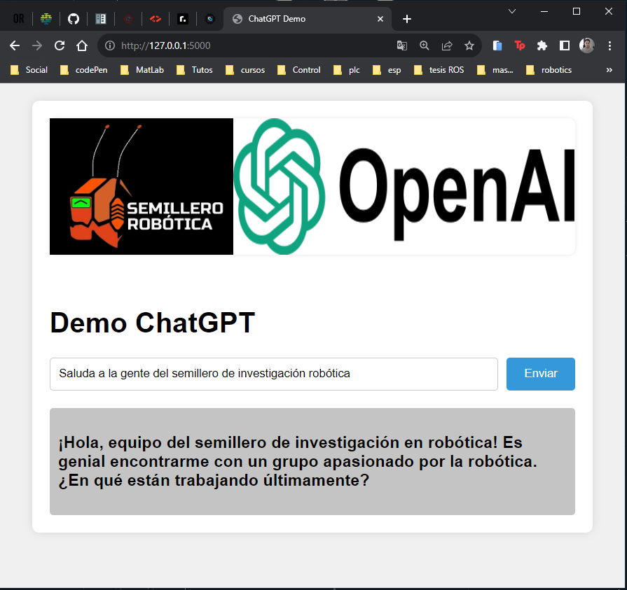

# Demo de Integración de ChatGPT con Flask

Este proyecto es una aplicación web desarrollada con Python utilizando Flask para el backend y HTML/CSS para el frontend. La aplicación integra la API de ChatGPT de OpenAI para proporcionar una demo interactiva de chat.


<div id="header" align="center">

</div>

## Características

- **Tecnologías utilizadas:** Python, Flask, HTML, CSS
- **Funcionalidades:**
  - Interfaz web para enviar solicitudes a la API de ChatGPT y recibir respuestas.
  - Incluye una imagen, un campo de entrada para el texto del usuario y un botón para enviar la solicitud.
  - Muestra la respuesta generada por ChatGPT en un área de texto.


La estructura de los archivos del proyecto

    demo-api-openai/
    ├── app.py             # Archivo principal de la aplicación Flask
    ├── templates/
    │   ├── index.html     # Archivo HTML para la interfaz web
    ├── static/
    │   ├── styles.css     # Archivo CSS para los estilos
    ├── assets/
    │   ├── logo-semillero.png     # logo open ai


## Instalación y Uso

1. Clona este repositorio:

   ```bash
   git clone https://github.com/MrDavidAlv/demo-api-openai

2. Reemplaza api-key-openai en el archivo app.py

    ```bash
    client = OpenAI(api_key='YOUR-API-KEY-OPENAI')

3. Librerias

    ```bash
    pip install -r requirements.txt

4. Ejecución 

    ```bash
    python app.py